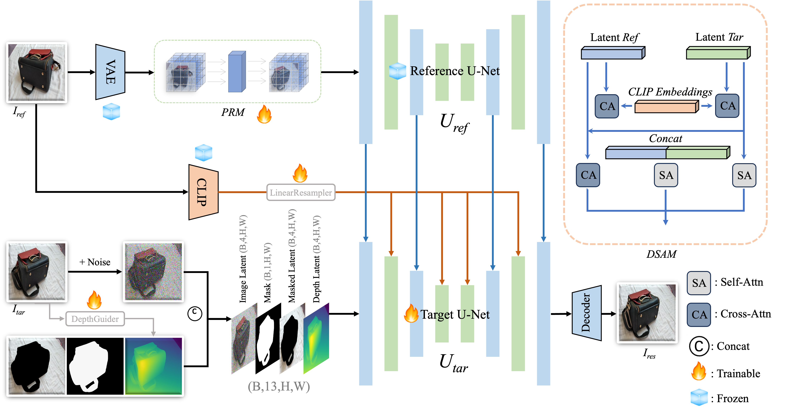

# Perspective-Aware Inpainting: Bridging Large Viewpoint Gaps for Reference-Guided Inpainting

## 🧩 Framework Overview



## 🧪 Experiments


## ⚙️ Installing Dependencies
```bash
pip install -r requirements.txt
```

## 📦 Model Weights
Please place the following model weight files in the corresponding directories:
- Depth model: Place according to the `depth_model` path in the configuration file
- Base model: Place according to the `pretrained_Target_Unet_path` path in the configuration file
- VAE model: Place according to the `pretrained_vae_name_or_path` path in the configuration file
- Image encoder: Place according to the `image_encoder_path` path in the configuration file
- Reference model: Place according to the `pretrained_Ref_Unet_path` path in the configuration file
- PAInpaint checkpoint: Place according to the `ckpt_path` path in the configuration file

### 📥 Download Links

The model weights can be downloaded from the following links:

- **Depth Anything Model**: [Download](https://huggingface.co/spaces/LiheYoung/Depth-Anything/blob/main/checkpoints/depth_anything_vitl14.pth)
- **Base Model**: [Download from Hugging Face](https://huggingface.co/stable-diffusion-v1-5/stable-diffusion-v1-5/tree/main)
- **VAE Model**: [Download from Hugging Face](https://huggingface.co/stabilityai/sd-vae-ft-mse)
- **Image Encoder**: [Download from Hugging Face](https://huggingface.co/openai/clip-vit-large-patch14)
- **Reference model**: [Download from Hugging Face](https://huggingface.co/botp/stable-diffusion-v1-5-inpainting/tree/main)
- **PAInpaint Checkpoint**: [Download from Google Drive](https://drive.google.com/file/d/1N994n80x7npNy_n74Y-R1u75v-9Bo89f/view?usp=share_link)

After downloading, place the weights in the `checkpoints` directory according to the paths specified in your configuration file.

## 📝 Configuration
Please check the `configs/inference.yaml` file before running to ensure all paths are set correctly.

## ▶️ Running Inference
```bash
bash run_test_final.sh
```

## 📁 Input Data
The inference script processes all reference images in the specified directory. Each test sample should include:
- ref_image.jpg: Reference image
- tar_image.jpg: Target image
- mask.png: Mask image

## 📂 Dataset Structure
The test dataset should be organized as follows:
```
test_data_directory/
├── sample1_ref_image.jpg    # Reference image for sample 1
├── sample1_tar_image.jpg    # Target image for sample 1
├── sample1_mask.png         # Mask image for sample 1
├── sample2_ref_image.jpg    # Reference image for sample 2
├── sample2_tar_image.jpg    # Target image for sample 2
├── sample2_mask.png         # Mask image for sample 2
└── ...                      # More samples
```

The script identifies related files by their naming pattern. For each reference image named `*ref_image.jpg`, it looks for the corresponding target image and mask with the same prefix.

## 📤 Output
The inference results will be saved in the output directory specified in the configuration file, including:
- Result image
- Reference image
- Masked target image
- Original target image
- Collage image
- Performance evaluation metrics 


## 🌸 Citation

If you find our work useful, please consider citing our paper using the following BibTeX:

```bibtex
@inproceedings{zhou2025PAInpaint,
  title     = {Perspective-Aware Inpainting: Bridging Large Viewpoint Gaps for Reference-Guided Inpainting},
  author    = {Zhou, Shengxiao and Li, Chenghua and Huang, Jianhao and Wang, Peisong},
  booktitle = {Proceedings of the International Conference on Virtual Reality and Visualization (ICVRV)},
  year      = {2025}
}